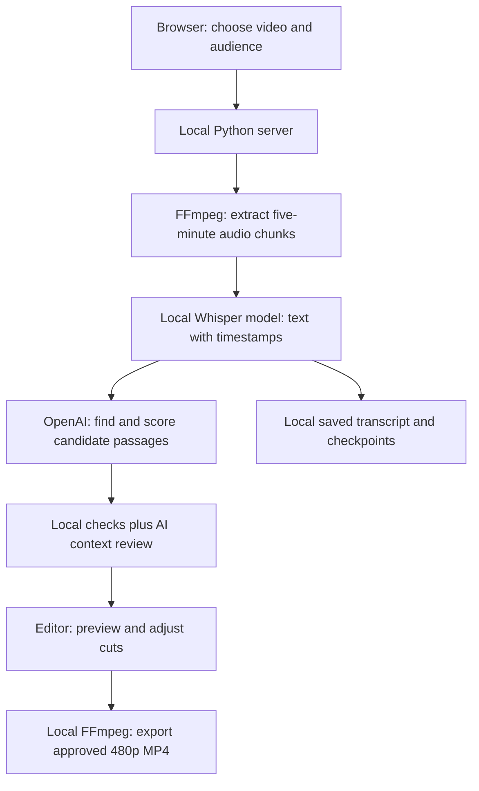

# Clip Assistant — first-version plan

## What we are building

A local editing assistant for interview producers. It helps an editor find promising passages in a long recording, understand why they might work, adjust the cuts, and export a 480p rough cut. The goal is less time from recording to an editor-approved clip, with the speaker's meaning preserved.

This is an independent audition project, not an official Steven.com product. The workflow is a hypothesis until an editor tests it.

## How it works

```text
local video -> local audio -> local transcript -> OpenAI text only
                                      -> human approval -> local 480p clips
```

- Keep source video/audio on the Mac; send transcript excerpts and timestamps only to OpenAI.
- Score hook clarity, specificity, payoff, audience fit, and standalone coherence equally from 0–4. The sum is 0–20 (optionally display 0–100); this is an editorial heuristic, not a probability or virality prediction.
- A separate context/truth guard is required; transcript analysis cannot verify claims or judge visuals.
- Default to contiguous 30–90 second clips. Multi-passage sequences require explicit approval and context/order warnings.

## The first screen-to-export journey

1. Choose a local video and describe its audience. Set the desired clip length.
2. The app extracts small audio chunks and transcribes them on the Mac. Saved checkpoints allow transcription to resume.
3. With a locally configured OpenAI key, transcript batches are assessed for candidate clips and context risks. Video and audio are never sent to OpenAI.
4. Review candidate passages beside the video and transcript. Inspect the score and risks; adjust or combine time ranges.
5. Preview the sequence, then approve and export a separate 480p MP4. The original remains unchanged.

Without an API key, a clearly labelled local mode provides rough passage windows, without AI editorial scores. This lets us test transcription and rendering without pretending the AI analysis ran.

## What the score means

| Criterion | Question |
|---|---|
| Hook | Does the beginning provide a reason to keep watching? |
| Specificity | Is there a concrete story, example or insight? |
| Payoff | Does it resolve the question or tension it creates? |
| Audience fit | Why would this project's audience care? |
| Coherence | Does it make sense without the rest of the interview? |

The total is an explainable editorial opinion, not a predicted engagement rate. Context risks remain separate. The transcript cannot establish factual truth, facial expression or visual impact.

## How we check the first version

- Run an actual local video through transcription and export; verify timestamps, duration, audio and 480p dimensions.
- Check multi-passage exports and a recording longer than one transcription chunk.
- Test invalid timestamps, invalid model references, missing API keys, interrupted jobs and unsafe browser requests.
- Label synthetic calibration material. A synthetic test proves plumbing, not editorial taste.
- Compare the top suggestions against an editor's independent choices on unseen interviews. Measure accepted clips and total review/correction time.

## Deliberate limits

Mac-first, English transcription initially, at most one transcription job and one export at a time. Audio is transcribed in consecutive five-minute chunks: a sentence crossing a boundary may need correction; we do not guess new timestamps to merge text. No automatic publishing, vertical reframing, captions or cloud video storage. Original-video browser preview depends on browser codec support. A 100 GB file stays on disk, but that size is not a tested guarantee; duration, codec and available disk space affect processing. A dedicated OpenAI key is configured locally. On 11 September 2026, a 14-minute real video completed three live analysis runs with three final suggestions and one clean 90-second 480p export; two suggestions still needed trimming, and the scores remain uncalibrated editorial ratings.

## Delivery order

Working local pipeline → working review screen → bounded AI analysis → end-to-end checks → editor trial. Keep the smallest complete workflow before adding integrations.


## Architecture — how the first version is built

The browser is the control panel. A small Python server on this Mac does the work. Only transcript text and analysis instructions go to OpenAI; the original video, extracted audio and exported clips stay local.



### The parts and their jobs

| Part | What it does | Where it runs |
|---|---|---|
| Browser interface (`web/`) | Video playback, transcript, suggestions, editable ranges and downloads | This Mac |
| Python server (`server.py`) | Starts jobs, reports progress and serves local media | This Mac, on `127.0.0.1:8765` |
| Media pipeline (`pipeline.py`) | Coordinates transcription, analysis and rendering | This Mac |
| FFprobe / FFmpeg | Checks media, extracts audio and renders cuts | This Mac |
| whisper.cpp + `base.en` | Converts English speech into timestamped transcript segments | This Mac |
| OpenAI Responses API + `gpt-5-mini` | Suggests passages, scores them and reviews surrounding context | OpenAI; text only |
| Local JSON files (`.data/`) | Save jobs, transcript checkpoints, suggestions and export records | This Mac |

No cloud video upload, cloud database or web hosting is needed for this version. The API key is read by Python from the ignored `.env` file; it is not sent to the browser.

### How a long recording becomes candidate clips

1. **Read the source from disk.** FFmpeg processes consecutive five-minute audio chunks rather than loading the entire video into memory. Whisper's chunk timestamps are mapped back to the original recording. Checkpoints let an interrupted transcription resume.
2. **Analyse manageable text batches.** Each OpenAI request receives up to 100 transcript segments, with 20 segments repeated between batches to retain context. Audio chunks themselves do not overlap. Segment IDs identify real transcript passages, so the model selects existing passages rather than inventing timestamps.
3. **Propose cuts and explain them.** The model returns a title, reason, five scores, risks, and one to three ordered source ranges per candidate. The Python code checks IDs, durations, duplicate ranges and score bounds, then keeps up to eight highest-scoring distinct candidates.
4. **Review context separately.** Another model call reads shortlisted passages and surrounding transcript segments, and can reject candidates or add warnings. This checks for missing context; it does not independently fact-check the interview.
5. **Let the editor decide.** The editor previews the original footage, adjusts cuts and approves the sequence. FFmpeg then renders the selected ranges in that order into a separate MP4, 480 pixels high with its aspect ratio preserved. An edited sequence can contain up to eight ranges.

### What “high engagement” means in version one

We do not yet have audience-performance data that proves which passages will perform well. The five criteria above are our starting editorial rubric. Each receives 0–4 points; the displayed score is their sum multiplied by five. A score of 80 means 16 out of 20 rubric points, **not an 80% chance of success**.

The score belongs to the original suggestion. Changing the cuts does not automatically rescore it. An exciting sentence can still make a poor clip if it loses context or has weak visual delivery; the human review step stays essential.

To improve the rubric, have an editor independently select clips from unseen interviews, then compare their choices with the app's shortlist. Track accepted suggestions and time spent reviewing/correcting. Later, with permission to use channel analytics, compare published clips using retention, completion and sharing measures within similar platforms, audiences and clip lengths. Adjust the scoring only when those results support a change.

### Reliability and current limits

- One transcription job and one export can run at a time. Progress and errors remain visible.
- Local mode uses rough passage suggestions with no AI score. A failed live analysis does not silently become a local result.
- Analysis has a configurable request-count ceiling, currently 40 calls per run. This is not a guaranteed spending cap. A recording needing more calls is rejected by live analysis rather than silently truncated.
- A 100 GB source stays on disk, but processing that size has not been tested. Duration, codec, disk space and analysis-call limits still matter.
- Verified: local transcription, a recording longer than five minutes, multiple-range 480p rendering, browser download, 21 automated tests, a live OpenAI connection check, and a real 14-minute live analysis and export run.
- Still to validate: editorial usefulness, actual engagement outcomes, reliable boundary selection, and a 100 GB input.
